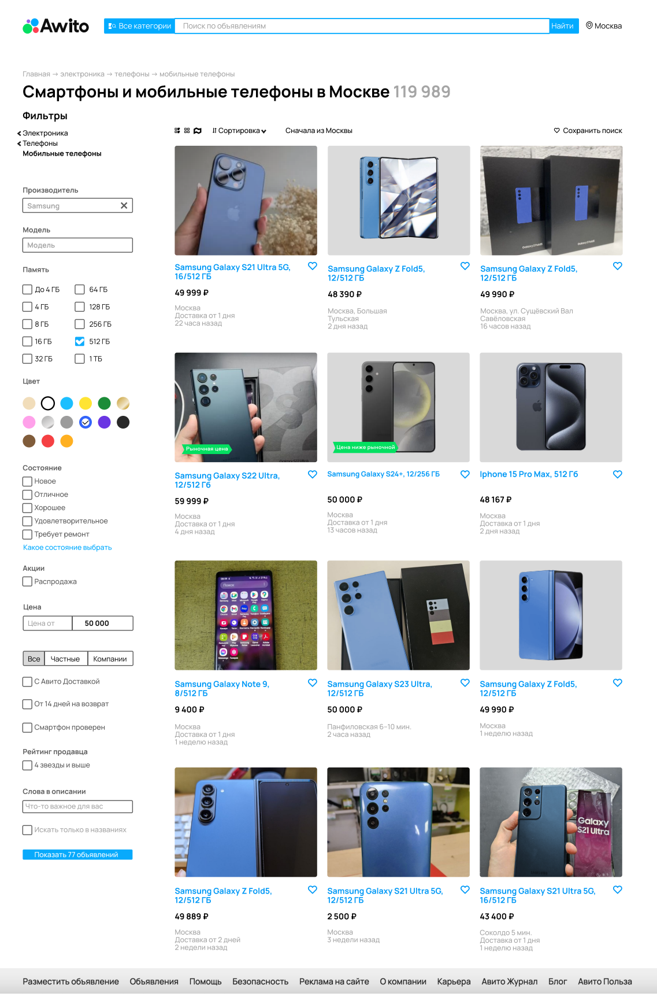

# Тестовое задание, Авито, QA

## Задание 1
Перед вами скриншот страницы Авито 
с результатами поиска. Изучите скриншот, перечислите все имеющиеся баги на странице поиска, укажите их приоритет (high, medium, low).

|   №   |                                       Заголовок                                       |                                                   Описание                                                   | Критичность | Приоритет |
| :---: | :-----------------------------------------------------------------------------------: | :----------------------------------------------------------------------------------------------------------: | :---------: | :-------: |
|   1   |                                  Опечатка в логотипе                                  |                                   Написано: Awito <br> Должно быть: Avito                                    |    Major    |   High    |
|   2   |           Нет переключателя (Toggle Button) для товаров "Сначала из Москвы"           |                                 Справа от надписи должен быть переключатель                                  |    Major    |   High    |
|   3   | По фильтру "Производитель" в поиске также отображаются телефоны другого производителя |          Фильтр: "Производитель" - Samsung; <br> Объявление: 6-й товар, "Iphone 15 Pro Max, 512 Гб"          |    Major    |  Medium   |
|   4   |           По фильтру "Память" отображается телефон с другим объёмом памяти            |           Фильтр: "Память" - 512 Гб; <br> Объявление: 5-ый товар, "Samsung Galaxy S24+, 12/256 Гб"           |    Major    |  Medium   |
|   5   |                 По фильтру "Цвет" отображаются телефоны других цветов                 |              Фильтр: синий; <br> Объявление: 5-ый товар, серый "Samsung Galaxy S24+, 12/256 Гб"              |    Major    |  Medium   |
|   6   |          По фильтру "Цена" до N отображаются телефоны с более высокой ценой           | Фильтр: цена до 50000; <br> Объявление: 4-ый товар, "Samsung Galaxy S22 Ultra, 12/512 Гб" с ценой 59999 руб. |    Major    |  Medium   |
|   7   |                    Названия категорий начинаются со строчных букв                     |        На сайте начинаются с заглавной: <br> Главная -> Электроника -> Телефоны -> Мобильные телефоны        |   Trivial   |    Low    |



## Задание 2

### Тест-кейсы
[TESTCASES.MD](./TESTCASES.MD)

### Скриншоты 
[output](./output)

### Инструкция
1. Склонировать репозиторий
   ``` git clone https://github.com/timermakov/TestAssignmentQA.git ```

2. Запустить Terminal в папке репозитория, в нём по очереди выполнить команды:
```
pip install pytest playwright asyncio pytest-asyncio 

pytest
```

### Контекст 

Скриншотные тесты используются для проверки визуального отображения интерфейса: дизайна, шрифтов, вёрстки, расположения элементов. Это один из самых нестабильных видов тестирования, но только он позволяет убедиться, что пользователь видит страницу именно такой, какой её задумал дизайнер. Для скриншотных тестов нужно получить «эталонные» снимки и своими глазами проверить, что на них всё так, как должно быть — в этом и будет смысл задания. 

### Условие 

На сайте https://www.avito.ru/avito-care/eco-impact расположены три счётчика для подсчёта эковклада пользователя: сохранённого объёма воды, предотвращённого объёма выброса CO2 и сэкономленной электроэнергии. Числа, отображаемые на счётчиках приходят с бэкенда. Обработку этих значений выполняет микрофронтенд: в его задачи, например, входит подстановка единиц измерений: замена 1000 литров на 1 метр кубический и т.д. 

### Суть задания

1. Составьте тест кейсы для тестирования счётчиков для десктопной версии. Оформите решение в файле TESTCASES.MD
2. Автоматизируйте тест кейсы.
   1) Можно выполнить на любом языке, фреймворке, драйвере (мы рекомендуем использовать связку python + pytest + playwright, но вы можете выбрать удобную вам); 
   2) В автоматизированных тест кейсах не нужно проверять результат, а только получить скриншот счётчиков (желательно сделать скриншот именно счётчика, а не всей страницы)
3. Запустите автоматизированные тесты
   1) Все тесты должны быть пройдены успешно 
   2) В папке «output» должны появиться скриншоты счётчиков; 
   3) Имена скриншотов должны соответствовать номерам тест кейсов: 
4. Запушьте все скриншоты в репозиторий
5. Напишите понятную и воспроизводимую инструкцию, выполнив которую можно заново получить все скриншоты в папке «output». Оформите инструкцию в файле README.md 
6. Если в результате тестирования найдены баги, то составьте баг-репорт в файле BUGS.md
